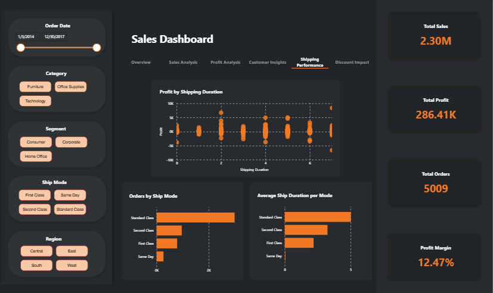

# 📊 Superstore Sales Analysis & Profit Prediction

This project analyzes the **Superstore dataset** using **Power BI** to extract business insights on sales, profit, and customer behavior, while also implementing a **machine learning model in Python** to predict whether a future order will result in a loss.

---

## 📁 Project Structure

- **Power BI Dashboard**: Multi-page, filterable business report
- **Python Notebook**: EDA, preprocessing, and profit-loss prediction model
- **Machine Learning Models**: Supervised classification for loss prediction
- **Data Modeling**: Star/snowflake schema for structured analysis

---

## 📈 Dashboard Overview

### 🧭 Shared Features (All Pages)
- **Filters**:  
  - Order Date  
  - Category  
  - Segment  
  - Ship Mode  
  - Region  

- **KPIs**:  
  - Total Sales  
  - Total Profit  
  - Total Orders  
  - Profit Margin  

These controls allow users to slice and analyze data from multiple perspectives across all report pages.

---

## 📄 Dashboard Pages & Visuals

### 1. **Overview**
**Screenshot:**

- Sales by Category & Subcategory (Bar Chart)
- Orders by Segment (Pie Chart)
- Monthly Sales & Profit Trends (Line Chart)

---

### 2. **Sales Analysis**
**Screenshot:**

- Treemap of Sales by Category/Sub-Category  
- Matrix of Sales by Category and Region  
- Top 10 Customers by Sales (Column Chart)  
- Sales Over Time (Line Chart)

---

### 3. **Profit Analysis**
**Screenshot:**

- Treemap of Profit by Category/Sub-Category  
- Sales vs. Profit (Scatterplot)  
- Profit by State (Map)  
- Table of Products with Negative Profit

---

### 4. **Customer Insights**
**Screenshot:**

- Sales by Segment (Donut Chart)  
- Matrix of Sales by Segment and Region  
- Top 10 Customers by Sales (Bar Chart)  
- Top 10 Customers by Profit (Bar Chart)

---

### 5. **Shipping Performance**
**Screenshot:**

- Profit vs. Shipping Duration (Scatterplot)  
- Number of Orders by Ship Mode (Bar Chart)  
- Average Shipping Duration per Ship Mode (Bar Chart)

---

### 6. **Discount Impact**
**Screenshot:**

- Quantity vs. Discount Value (Scatterplot)  
- Sales by Discount Value (Bar Chart)  
- Average Profit by Discount Value (Bar Chart)

---

## 🧪 Python-Based Data Analysis

### 🔍 Key Insights (EDA)
- Highest average sales and profit in **March**
- **Copiers** in **Technology** had the highest average sales and profit
- Top customers by sales and profit identified
- Many orders generated **negative profit**
- Discount usage varied by region, segment, and shipping method

---

## 🤖 Machine Learning: Predicting Profit Loss

### 🎯 Objective:
Classify whether a new order will result in profit or loss.

### 🧠 Features Used:
- Ship Mode  
- Segment  
- State  
- Sub-Category  
- Sales  
- Quantity  
- Discount  
- Order Day/Month  
- Ship Day/Month  

### 🛠️ Model Development:
- Preprocessing with one-hot encoding, standard scaling and feature engineering  
- Train/test split  
- Hyperparameter tuning using GridSearchCV  

### 📊 Model Comparison:

| Model               | Train_F1 | Train_Acc | Test_F1 | Test_Acc |
|--------------------|----------|-----------|---------|----------|
| Logistic Regression| 0.8388   | 0.9447    | 0.8522  | 0.9489   |
| K-NN               | 1.0000   | 1.0000    | 0.7927  | 0.9315   |
| Support Vector     | 0.8250   | 0.9430    | 0.8287  | 0.9439   |
| Decision Tree      | 0.8542   | 0.9497    | 0.8526  | 0.9489   |
| Random Forest      | 0.9608   | 0.9857    | 0.8509  | 0.9489   |
| XGBoost            | 0.8621   | 0.9538    | 0.8419  | 0.9464   |
| LightGBM           | 0.8632   | 0.9538    | 0.8475  | 0.9479   |

---

## 🧱 Data Model (Power BI)

**Screenshot:**  

Modeled using a **snowflake schema** to ensure normalized and efficient relationships.

### 🟩 Fact Table
- `FactSales`: Contains transaction-level data (e.g., sales, quantity, discount, profit)

### 🟨 Dimension Tables
- `DimCustomer`, `DimOrder`, `DimProduct`, `DimCategory`, `DimSubCategory`, `DimShipping`, `DimCity`, `DimState`, `DimRegion`, `DimSegment`

---

## 🚀 Future Improvements

- Integrate product return data  
- Add predictive time-series forecasting (e.g., ARIMA, Prophet)  
- RFM-based customer segmentation  
- Deploy ML model as an API for real-time prediction  

---

## 📌 Summary

This project delivers both **descriptive** (Power BI) and **predictive** (Python ML) analytics on retail data. It’s designed to support data-driven decisions across customer targeting, pricing strategy, shipping performance, and discount policies.
